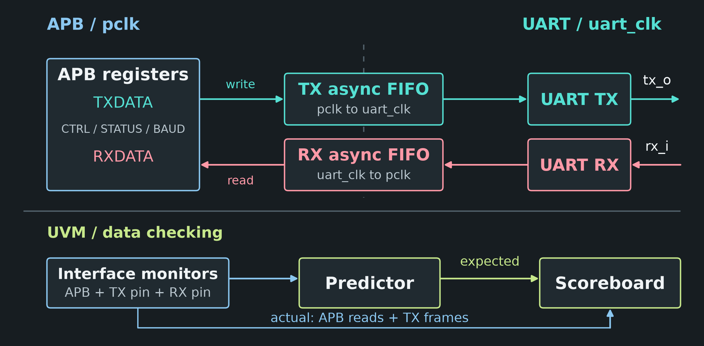

# APB UART FIFO UVM

**Verify the design. Test the checkers.**

A SystemVerilog/UVM project for APB-UART verification: dual-clock FIFOs,
monitor-driven prediction, protocol assertions, UVM RAL, and fault injection.

[Release v0.1.0](https://github.com/zlsjtj/apb-uart-fifo-uvm/releases/tag/v0.1.0) ·
[Download](https://github.com/zlsjtj/apb-uart-fifo-uvm/releases/download/v0.1.0/apb-uart-fifo-uvm-0.1.0-source.zip) ·
[Validation](https://github.com/zlsjtj/apb-uart-fifo-uvm/releases/download/v0.1.0/validation.json)<br>
[Quick start](#choose-a-run) ·
[Debugging case](#independent-checks-in-action) · [中文入门](docs/quickstart.md)

<picture>
  <source media="(max-width: 1023px)" srcset="docs/assets/architecture-mobile.png">
  
</picture>

[Architecture](docs/architecture_figures.md) · [Results](#recorded-results) ·
[Follow one byte](#follow-one-byte-through-uvm) · [Diagram source](docs/assets/README.md)

[](https://github.com/zlsjtj/apb-uart-fifo-uvm/actions/workflows/fifo-smoke.yml)

## Recorded Results

**v0.1.0, revalidated 2026-10-04.** These runs used an isolated checkout of
[`fca5a7c`](https://github.com/zlsjtj/apb-uart-fifo-uvm/commit/fca5a7c52b7f3bf393c326ecf26f23d78c1f98d6).

| Result | What was checked |
| --- | --- |
| **60/60 passed** | 20 UVM tests across base seeds 101, 201, 301 |
| **13/13 detected** | Injected RTL faults, each paired with a passing same-test, same-seed baseline |
| **8/8 passed** | Free FIFO baselines at four depths and two clock ratios; both negative controls detected |
| **69/69 hit** | Declared functional bins in merged coverage; 19/19 RTL coverage gates passed |

[Release notes](https://github.com/zlsjtj/apb-uart-fifo-uvm/releases/tag/v0.1.0) ·
[Logs and coverage databases](https://github.com/zlsjtj/apb-uart-fifo-uvm/releases/download/v0.1.0/apb-uart-fifo-uvm-0.1.0-verification.zip) ·
[SHA-256 checksums](https://github.com/zlsjtj/apb-uart-fifo-uvm/releases/download/v0.1.0/SHA256SUMS.txt)

<details>
<summary>Earlier acceptance snapshot: 2026-09-13</summary>

**Verification snapshot: 2026-09-13.** Each result links to its saved report.

| Result | What was checked |
| --- | --- |
| **60/60 passed** | [UVM regression](reports/published/20260913_134519_8d9500ab/reports/final_regression/final_regression_summary.json): 20 tests across three base seeds |
| **13/13 detected** | [Injected RTL faults](reports/published/20260913_134519_8d9500ab/reports/mutation_campaign.json), each paired with a passing baseline |
| **24/24 passed** | [FIFO depth subsets](reports/published/20260913_134519_8d9500ab/reports/parameter_regression/summary.json) across depths 2, 4, 16, 64 |
| **69/69 hit** | [Declared functional bins](reports/published/20260913_134519_8d9500ab/reports/final_regression/coverage/functional_assertion_gate.json) in the coverage model |

[Full results](reports/published/20260913_134519_8d9500ab/paper_results.md) ·
[Run manifest and source identity](reports/published/20260913_134519_8d9500ab/acceptance_summary.json) ·
[Reproduce the campaign](docs/reproduction_and_delivery.md)

</details>

## What Makes This Useful

- **Independent expectations.** The [predictor](tb/uvm/uart_predictor.svh)
  builds expected data from observed APB transfers and serial frames. The
  [scoreboard](tb/uvm/uart_scoreboard.svh) checks data, order, and leftover expectations.
- **Tests for the checkers themselves.** The [mutation campaign](config/mutation_plan.psd1)
  deliberately breaks APB timing, FIFO behavior, and TX completion, then requires
  the intended detector to report the fault.
- **Cross-clock and recovery scenarios.** The [test plan](config/verification_plan.psd1)
  exercises FIFO boundaries, skewed clocks, configuration changes, malformed
  frames, and resets during traffic.
- **A UVM environment you can trace.** [Agents, predictor, scoreboard, RAL,
  and coverage](tb/uvm/uart_env.svh) are connected in one environment, with
  [a byte-by-byte reading path](#follow-one-byte-through-uvm) and recorded waveforms.

## Choose a Run

| Route | Tools and scope |
| --- | --- |
| [Free FIFO smoke](#free-fifo-smoke) | Ubuntu/WSL, Icarus 12.0, Bash, GNU coreutils. Standalone reference-queue and fault-detection tests. |
| [UVM loopback](#uvm-loopback) | Windows, PowerShell 7, licensed ModelSim/Questa. APB/UART agents, predictor, scoreboard, assertions. |

### Free FIFO Smoke

Run the standalone FIFO checks on Ubuntu 24.04 or Ubuntu in WSL:

```bash
sudo apt-get update
sudo apt-get install -y iverilog
git clone https://github.com/zlsjtj/apb-uart-fifo-uvm.git
cd apb-uart-fifo-uvm
bash scripts/run_fifo_smoke.sh
```

This runs the existing reference-queue test at four FIFO depths and two clock
ratios, then checks that a stuck-low full flag and corrupted read data are
detected. It was tested with Icarus 12.0. Logs go into a new directory under
`work_fifo_smoke/run.*`; success ends with:

```text
FIFO smoke: 8/8 baselines passed; 2/2 injected faults detected.
```

The [GitHub Actions workflow](.github/workflows/fifo-smoke.yml) runs this same
FIFO-only suite and retains its logs. The badge reports that workflow.
UVM and SVA run through the ModelSim/Questa route below.

<details>
<summary>Recorded CI run</summary>

The [2026-10-04 cloud run for `d4d72f3`](https://github.com/zlsjtj/apb-uart-fifo-uvm/actions/runs/37186769748)
passed.

</details>

### UVM Loopback

Use Windows, PowerShell 7 (`pwsh`), and a licensed ModelSim/Questa installation
with SystemVerilog, UVM, assertions, and coverage support. The recorded run used
ModelSim SE-64 10.4 with its bundled UVM 1.1d. Vivado is used by the separate
synthesis/full acceptance flow. See [tool compatibility](docs/interface_and_scope.md#tool-compatibility)
for the tested setup.

```powershell
git clone https://github.com/zlsjtj/apb-uart-fifo-uvm.git
cd apb-uart-fifo-uvm
# Skip this line if vlib, vlog, vsim and vcover are already on PATH.
$env:APB_UART_QUESTA_BIN = 'C:\modeltech64_10.4\win64'
pwsh -NoProfile -File scripts/run_questa.ps1 -Tests uart_loopback_test -Seed 2 -DumpLoopbackVcd
```

Change the simulator path to your installation. A successful run writes
`Passed 1/1 tests.` to `reports/regression_summary.md` and produces:

- `logs/uart_loopback_test_2.log`: transactions and scoreboard results.
- `reports/uart_loopback_test_2.vcd`: APB and serial signals for a waveform viewer.
- `reports/uart_loopback_test_2.ucdb`: this test's coverage database.

The script compiles the design and testbench; no prebuilt `work` library is
required. Generated logs, waveforms, and UCDB files stay local. For setup errors,
test selection, and coverage commands, see the
[Chinese setup guide](docs/quickstart.md).
Without the simulator, inspect the [recorded log and VCD](examples/loopback/README.md).

<a id="a-real-loopback-run"></a>

## Loopback Example

<picture>
  <source media="(prefers-color-scheme: dark)" srcset="examples/loopback/byte-preview-dark.png">
  <source media="(prefers-color-scheme: light)" srcset="examples/loopback/byte-preview.png">
  
</picture>

`uart_loopback_test`, seed 2, recorded **2026-10-04**: six bytes
(`00 55 aa ff 13 37`) sent and read back. The preview follows the second byte,
`0x55`; its time axis shows serial TX only, not APB transfer timing.
[Full waveform, VCD, log, and plot scripts](examples/loopback/README.md).

## Follow One Byte Through UVM

1. **Sequence:** [uart_loopback_seq](tb/uvm/sequences/uart_functional_sequences.svh)
   configures loopback, writes six TXDATA bytes, then reads RXDATA.
2. **Driver:** [apb_driver](tb/uvm/apb_driver.svh) turns each item into an APB
   transfer and samples its response at the completion edge.
3. **Monitors:** [apb_monitor](tb/uvm/apb_monitor.svh) reports completed transfers;
   [uart_monitor](tb/uvm/uart_monitor.svh) observes the TX pin using configured
   bit timing, not the DUT's internal baud tick.
4. **Predictor:** [uart_predictor](tb/uvm/uart_predictor.svh) makes TX expectations
   from successful APB TXDATA writes. In loopback, RX expectations come from
   observed TX frames. In external-RX tests, they come from the
   [RX pin monitor](tb/uvm/uart_rx_monitor.svh), not the stimulus driver.
5. **Scoreboard:** [uart_scoreboard](tb/uvm/uart_scoreboard.svh) compares expected
   TX bytes with observed frames, and expected RX bytes with successful APB
   reads. Unconsumed expectations also fail the test.

The connections are in [uart_env.svh](tb/uvm/uart_env.svh), with an
[architecture overview](docs/architecture_figures.md). For a next test,
try `uart_frame_error_test` or `uart_fifo_wrap_test`; the default 20-test list
is in [verification_plan.psd1](config/verification_plan.psd1).

<a id="a-passing-regression-that-missed-a-bug"></a>

## Independent Checks in Action

**A 2 ns sampling offset hid an APB timing bug. An independent checker exposed it.**

In the earlier implementation, the DUT updated PRDATA and PSLVERR after the
completion edge, while both driver and monitor sampled late. A separate test
read BAUD as **0 at the edge, 16 later** and revealed the shared assumption.

The fix aligned the response and BFM with the completion edge using
`input #1step`. The independent [APB contract test](tb/unit/apb_contract_tb.sv)
and `apb_late` mutation preserve the regression check.
[Walk through the failure, fix, and fault-injection comparison](docs/bug_closure_case.md#english).

The [TX completion case](docs/tx_completion_case.md#english) follows another
boundary: a FIFO becoming empty before the final stop bit finishes.

<a id="interface-and-limits"></a>

## Register Interface

| Address | Register | Purpose |
| --- | --- | --- |
| `0x00` | CTRL | Enable, loopback, IRQ enable |
| `0x04` | STATUS | FIFO flags, IRQ, frame error, CFG_BUSY, TX_BUSY |
| `0x08` | BAUD | Bit-tick divider |
| `0x0c` | TXDATA | Write a TX byte |
| `0x10` | RXDATA | Read an RX byte |

The verification target uses zero-wait-state APB and fixed 8N1 framing.
See [register definitions](rtl/apb_uart_reg_pkg.sv), the
[interface contract and verification scope](docs/interface_and_scope.md), and
the loopback [source manifest](examples/loopback/manifest.json).

## License

This project is licensed under the [MIT License](LICENSE).
External tools and libraries retain their own licenses.

## Report a Problem

Use the [bug/setup form](https://github.com/zlsjtj/apb-uart-fifo-uvm/issues/new?template=bug_report.yml)
or browse [existing issues](https://github.com/zlsjtj/apb-uart-fifo-uvm/issues).
Include the command, commit, simulator version, seed, and first failing log message. Setup failures
and small reproducing tests are useful contributions. Please include a failing
case with behavioral fixes; see the [documentation index](docs/README.md) for
the relevant tests and reports.

**Working on a UVM project?** Star this repository to keep the examples,
checker patterns, and debugging cases handy.
