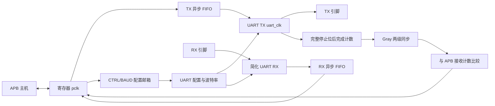
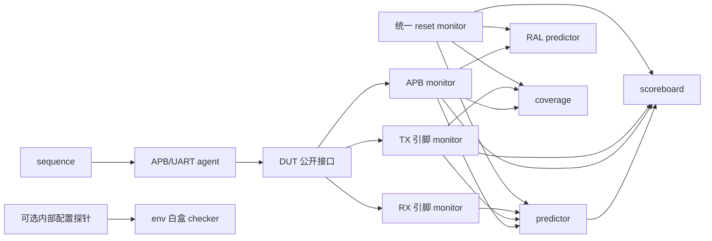
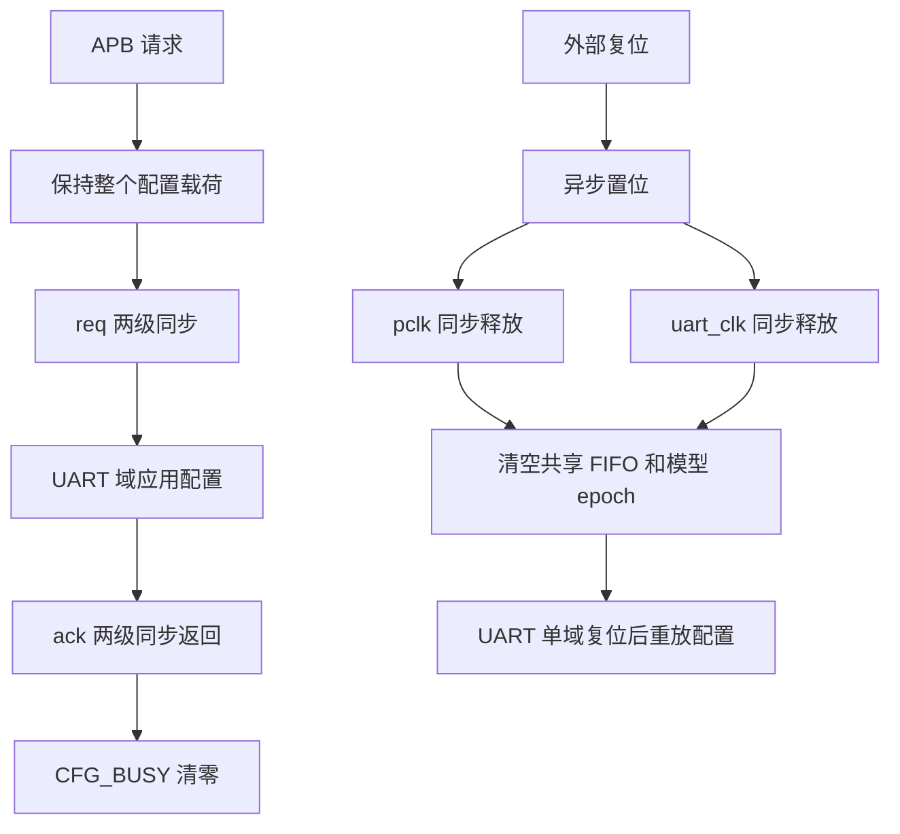

# 当前架构图

图示对应固定 8N1 验证模型，不代表完整工业 UART 或板级实现。

## 数据通路

TX_EMPTY 只说明 FIFO 已空。TX_BUSY 还包括在途发送；disable 中止和 reset 丢弃不能当作成功送达。

## UVM 环境

RAL 只接 APB 事务，RX 引脚事务先进入 predictor，再与 APB 读回的数据比较。探针不生成串行期望；无探针模式移除相关类和接口实例。

## 配置 CDC 与复位

配置握手不自动证明外部 RX 空闲。正常改配置需停止提交 TX、等待 TX_BUSY/CFG_BUSY，并由通信协议保证没有在途 RX 帧。

源码入口为 rtl/apb_uart.sv、tb/uvm/uart_env.svh。环境预检查、快照内回归和证据门禁由 run_acceptance.ps1 组织，选定 PASS 运行后由 export_acceptance.ps1 校验发布。
