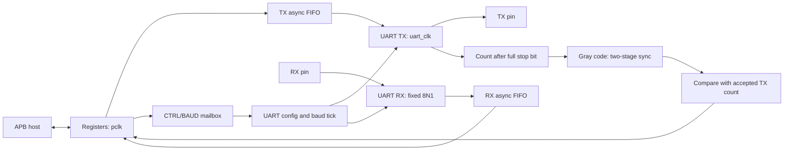
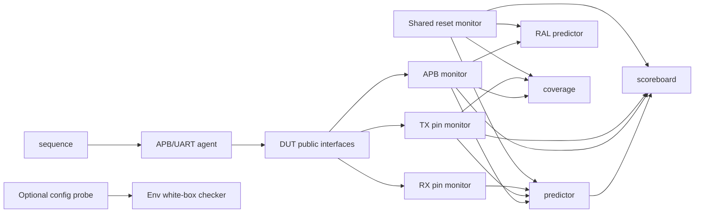
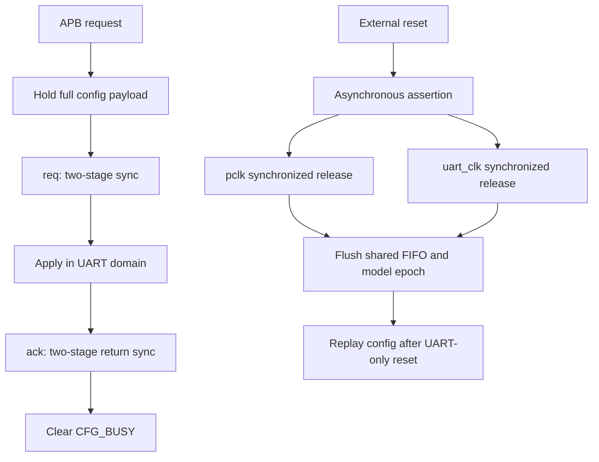

# Architecture / 架构

These diagrams describe the fixed-8N1 teaching model, not a production UART IP
or a board implementation. Start at [apb_uart.sv](../rtl/apb_uart.sv) for hardware
and [uart_env.svh](../tb/uvm/uart_env.svh) for verification connections.

图示对应固定 8N1 验证模型，不代表完整工业 UART 或板级实现。

[Homepage overview and editable figure source](assets/README.md) / [首页概览图及图源](assets/README.md)

## Data Path / 数据通路

```mermaid
flowchart LR
  APB[APB host] <--> REG[Registers: pclk]
  REG --> TXF[TX async FIFO]
  TXF --> TX[UART TX: uart_clk]
  TX --> TXPIN[TX pin]
  RXPIN[RX pin] --> RX[UART RX: fixed 8N1]
  RX --> RXF[RX async FIFO]
  RXF --> REG
  REG --> MAIL[CTRL/BAUD mailbox]
  MAIL --> CORE[UART config and baud tick]
  CORE --> TX
  CORE --> RX
  TX --> DONE[Count after full stop bit]
  DONE --> GRAY[Gray code: two-stage sync]
  GRAY --> BUSY[Compare with accepted TX count]
  BUSY --> REG
```

TX_EMPTY describes the FIFO only. TX_BUSY also includes bytes still in flight.
Disable aborts and reset discards must not be counted as successful delivery.

TX_EMPTY 只说明 FIFO 已空。TX_BUSY 还包括在途发送；disable 中止和 reset 丢弃不能当作成功送达。

## UVM Environment / 验证环境

```mermaid
flowchart LR
  SEQ[sequence] --> AGENT[APB/UART agent]
  AGENT --> DUT[DUT public interfaces]
  DUT --> AM[APB monitor]
  DUT --> TM[TX pin monitor]
  DUT --> RM[RX pin monitor]
  AM --> PRED[predictor]
  TM --> PRED
  RM --> PRED
  PRED --> SB[scoreboard]
  AM --> SB
  TM --> SB
  AM --> RAL[RAL predictor]
  AM --> COV[coverage]
  TM --> COV
  RESET[Shared reset monitor] --> PRED
  RESET --> SB
  RESET --> RAL
  RESET --> COV
  PROBE[Optional config probe] --> CHECK[Env white-box checker]
```

RAL consumes APB transactions only. RX pin observations enter the predictor
before comparison with APB readback. Internal probes do not generate expected
serial data; NoWhitebox mode removes the related probe classes and instances.

RAL 只接 APB 事务，RX 引脚事务先进入 predictor，再与 APB 读回的数据比较。探针不生成串行期望；无探针模式移除相关类和接口实例。

## Configuration CDC and Reset / 配置跨域与复位

```mermaid
flowchart TD
  REQ[APB request] --> HOLD[Hold full config payload]
  HOLD --> SYNC[req: two-stage sync]
  SYNC --> APPLY[Apply in UART domain]
  APPLY --> ACK[ack: two-stage return sync]
  ACK --> READY[Clear CFG_BUSY]
  EXT[External reset] --> ASSERT[Asynchronous assertion]
  ASSERT --> PCLK[pclk synchronized release]
  ASSERT --> UCLK[uart_clk synchronized release]
  PCLK --> EPOCH[Flush shared FIFO and model epoch]
  UCLK --> EPOCH
  EPOCH --> REPLAY[Replay config after UART-only reset]
```

The configuration handshake does not establish that external RX is idle.
Normal reconfiguration stops new TX submissions, waits for TX_BUSY and CFG_BUSY
to clear, and relies on the external protocol to keep RX free of in-flight frames.

配置握手不自动证明外部 RX 空闲。正常改配置需停止提交 TX、等待 TX_BUSY/CFG_BUSY，并由通信协议保证没有在途 RX 帧。

For the full snapshot-based acceptance flow, see
[reproduction and delivery (中文)](reproduction_and_delivery.md).
环境预检查、快照内回归和证据门禁由 `run_acceptance.ps1` 组织；选定 PASS 运行后，
`export_acceptance.ps1` 校验并导出本地交付包。
