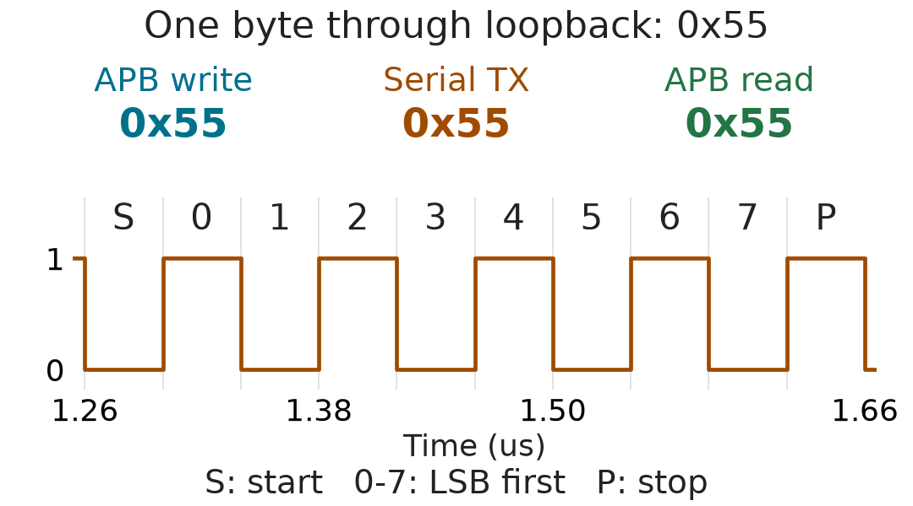

# 先跑通一个测试

这个项目用一个简化的 APB-UART 练习 UVM 验证。比较适合已经了解一点
SystemVerilog、想把 agent、monitor 和 scoreboard 连起来看的人。
UART 固定为 8N1，没有 16 倍过采样，也没有板级串口实测结论。

没有商业仿真器时，可以先跑下面的 FIFO 自检。已经有 ModelSim/Questa 时，
可以直接看后面的 UVM 回环：APB 写入字节，UART 回环接收，再由 APB
读回，scoreboard 检查数据和顺序。

[选一条运行路线](#选一条运行路线) · [沿着一个字节读代码](#沿着一个字节读代码) ·
[APB 回归为什么漏检](bug_closure_case.md#chinese) · [文档索引](README.md#chinese)

## 先看一轮真实回环



这是 2026-10-04 的 `uart_loopback_test`，seed 为 2。发送和读回的字节为
`00 55 aa ff 13 37`。预览选取第二个字节 `0x55`，S/P 分别表示起始位和停止位，
数据位 0 到 7 从最低位开始发送。横轴只表示串行 TX 时间，不表示 APB 访问时刻。
[完整波形、原始 VCD、日志和生成方法](../examples/loopback/README.md) 都在样本目录。

## 选一条运行路线

| 路线 | 依赖 | 范围 |
| --- | --- | --- |
| 免费 FIFO 自检 | Ubuntu/WSL、Icarus 12.0、Bash、GNU coreutils | 参考队列测试，不含 UVM 和 SVA |
| UVM 回环 | Windows、PowerShell 7、具备许可的 ModelSim/Questa | APB/UART agent、predictor、scoreboard 和断言 |

### 免费的 FIFO 自检

在 Ubuntu 24.04 或 WSL 的 Ubuntu 终端中执行：

```bash
sudo apt-get update
sudo apt-get install -y iverilog
git clone https://github.com/zlsjtj/apb-uart-fifo-uvm.git
cd apb-uart-fifo-uvm
bash scripts/run_fifo_smoke.sh
```

已在 Icarus 12.0 上验证。脚本复用 `async_fifo_random_tb.sv` 的参考队列，
检查深度 2/4/16/64、两组读写时钟、满空状态、数据顺序、指针回绕和流量中的共享复位。
然后用第一组基线的相同参数和 seed，分别强制 full 为低、翻转读数据一位，
要求出现指定的溢出或数据比较错误。编译失败、超时和无关错误都不能冒充检出。

成功时输出 `FIFO smoke: 8/8 baselines passed; 2/2 injected faults detected.`。
每轮日志单独写入 `work_fifo_smoke/run.*`，包含工具版本、编译日志、仿真日志和摘要。
[Actions 配置](../.github/workflows/fifo-smoke.yml) 使用相同命令。
提交 `d4d72f3` 的 [2026-10-04 云端运行](https://github.com/zlsjtj/apb-uart-fifo-uvm/actions/runs/37186769748)
已通过；首页徽章只表示 FIFO 检查状态，不代表完整 UVM 回归。

这项检查只覆盖 FIFO，不运行 UVM，也不运行 SVA。Icarus 编译时跳过不支持的
四条 FIFO 内联 SVA，原来的 ModelSim/Questa 流程继续保留这些断言。
两个反向检查不计入历史报告中的 13 项 RTL mutation。

### UVM 回环环境

- Windows、Git、PowerShell 7。命令里的 `pwsh` 指 PowerShell 7。
- 支持 SystemVerilog/UVM、SVA 和 coverage 的 ModelSim/Questa，以及可用许可。
- 已保存结果使用 ModelSim SE-64 10.4、自带 UVM 1.1d；其他版本尚未验证。
- 运行下面的 UVM 测试不需要 Vivado。综合和完整验收另需 Vivado，已记录版本为 2023.2。

仓库没有附带商业仿真器或许可证，完整 UVM 环境尚未在 Icarus/Verilator 上验证。
没有这些工具时，也可以看 [回环日志与波形样本](../examples/loopback/README.md)、
[APB 采样错误案例](bug_closure_case.md#chinese) 和
[保存的结果](../reports/published/20260913_134519_8d9500ab/paper_results.md)。

### 运行

在 PowerShell 中执行：

```powershell
git clone https://github.com/zlsjtj/apb-uart-fifo-uvm.git
cd apb-uart-fifo-uvm
$env:APB_UART_QUESTA_BIN = 'C:\modeltech64_10.4\win64'
pwsh -NoProfile -File scripts/run_questa.ps1 -Tests uart_loopback_test -Seed 2 -DumpLoopbackVcd
```

把路径改为自己的安装目录。如果 `vlib`、`vlog`、`vsim`、`vcover` 已经在
PATH 中，可以省略环境变量那一行。命令应在仓库根目录运行。

成功时 `reports/regression_summary.md` 的末尾会出现 `Passed 1/1 tests.`。
输出位置是：

| 文件 | 看什么 |
| --- | --- |
| `logs/compile_questa.log` | 编译错误或警告 |
| `logs/uart_loopback_test_2.log` | `[SB_SUMMARY]`、`[TEST_DONE]` 和 UVM 错误统计 |
| `reports/uart_loopback_test_2.vcd` | APB 访问与 UART 串行波形，可用 GTKWave 等查看 |
| `reports/uart_loopback_test_2.ucdb` | 本次仿真的覆盖率数据库 |
| `reports/regression_summary.md` | 本次命令的汇总 |

通过标准不只是进程退出码为零：脚本还检查测试结束标记、scoreboard 汇总、
UVM warning/error/fatal、仿真器错误和 UCDB。后续运行会更新根目录下的
regression summary；单个测试通过不能替代完整回归结果。

## 沿着一个字节读代码

1. **Sequence**：[uart_loopback_seq](../tb/uvm/sequences/uart_functional_sequences.svh)
   设置回环，把六个字节写入 TXDATA，再逐个读 RXDATA。
2. **Driver**：[apb_driver](../tb/uvm/apb_driver.svh) 把 item 变成 APB 传输，
   在完成沿采样响应。这里的“发出请求”不等于 DUT 一定接收成功。
3. **Monitor**：[apb_monitor](../tb/uvm/apb_monitor.svh) 记录总线上完成的访问；
   [uart_monitor](../tb/uvm/uart_monitor.svh) 观察 TX 引脚，按配置的位周期读帧，
   不取 DUT 内部 baud tick 作为判据。
4. **Predictor**：[uart_predictor](../tb/uvm/uart_predictor.svh) 从成功的 TXDATA
   写入产生 TX 期望；回环 RX 期望来自实际观测到的 TX 帧。外部 RX 测试则使用
   [RX 引脚 monitor](../tb/uvm/uart_rx_monitor.svh) 的观测，不直接采用 driver 声称发送的数据。
5. **Scoreboard**：[uart_scoreboard](../tb/uvm/uart_scoreboard.svh) 把 TX 期望与
   观测帧比较，把 RX 期望与成功的 APB 读回值比较；结束时队列未清空也报错。

端口连接看 [uart_env.svh](../tb/uvm/uart_env.svh)，硬件路径看
[架构图](architecture_figures.md)，寄存器地址看 [寄存器定义](../rtl/apb_uart_reg_pkg.sv)。

## 看一次漏检怎样被发现

以前 DUT 的 APB 读响应晚于完成沿，driver 和 monitor 又都延后 2 ns 采样，
结果两者一起“通过”。独立小测试在完成沿读 BAUD 得到 0，延后才得到正确的 16。
修复后保留了独立测试，并用 `apb_late` 故障注入确认检查器能抓住旧问题。
[案例、源码和对照命令](bug_closure_case.md#chinese) 可以连起来看。

## 接着试什么

把 `-Tests` 后面的名字换成 `uart_frame_error_test`，可以检查错误停止位与恢复。
关闭内部配置探针，用下面的命令检查公开接口路径：

```powershell
pwsh -NoProfile -File scripts/run_questa.ps1 -Tests uart_no_probe_test -NoWhitebox
```

一次选多个测试时，在 PowerShell 里直接传数组：

```powershell
./scripts/run_questa.ps1 -Tests @('uart_reg_test', 'uart_loopback_test') -Seed 2
```

`Seed` 是第一个测试的 seed，后面的测试依次加 1。保留汇总中的实际 seed，
复现某一失败用例时，用单测试命令传入那个 seed。

默认 20 个测试及其覆盖率：

```powershell
pwsh -NoProfile -File scripts/run_questa.ps1
pwsh -NoProfile -File scripts/merge_coverage.ps1
```

第二条命令只合并最新 regression summary 中列出的测试。HTML 入口为
`reports/coverage/html/index.html`，不要把只运行一个测试后生成的覆盖率当成全项目覆盖率。

需要独立快照、参数矩阵、故障注入和综合时，再按
[复现与交付](reproduction_and_delivery.md) 配好工具，运行：

```powershell
pwsh -NoProfile -File scripts/run_acceptance.ps1
```

## 常见问题

| 现象 | 先检查 |
| --- | --- |
| 找不到 `pwsh` | 是否安装了 PowerShell 7，并重新打开终端 |
| 找不到 `vlog` 或 `vsim` | `APB_UART_QUESTA_BIN` 是否指向包含这些程序的目录 |
| 无法导入 `uvm_pkg` | 仿真器的 UVM 库配置与版本；保留完整编译日志 |
| 许可证错误、无法加载设计 | 先检查仿真器安装与许可，这种运行不算 DUT 测试失败证据 |
| UVM_ERROR 或 assertion failure | 记录第一条错误、命令、commit、工具版本和实际 seed |

报错可提交到 [Issues](https://github.com/zlsjtj/apb-uart-fifo-uvm/issues)。
先附命令和第一条错误即可，分享日志前检查本机路径等信息。

## 结果与范围

上图只对应一个回环测试。[2026-09-13 的完整结果表](../reports/published/20260913_134519_8d9500ab/paper_results.md)
属于另一轮固定源码快照，不能当成当前改动重新跑过完整验收的证明。
69/69 功能 bin 和 13/13 故障检出也只针对声明的覆盖模型和故障清单。
仓库尚未选择许可证，公开可见不等于已经明确授予开源使用权限。

完整导航见 [文档索引](README.md)。
