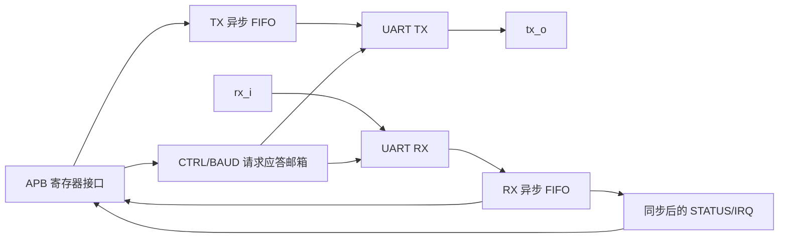
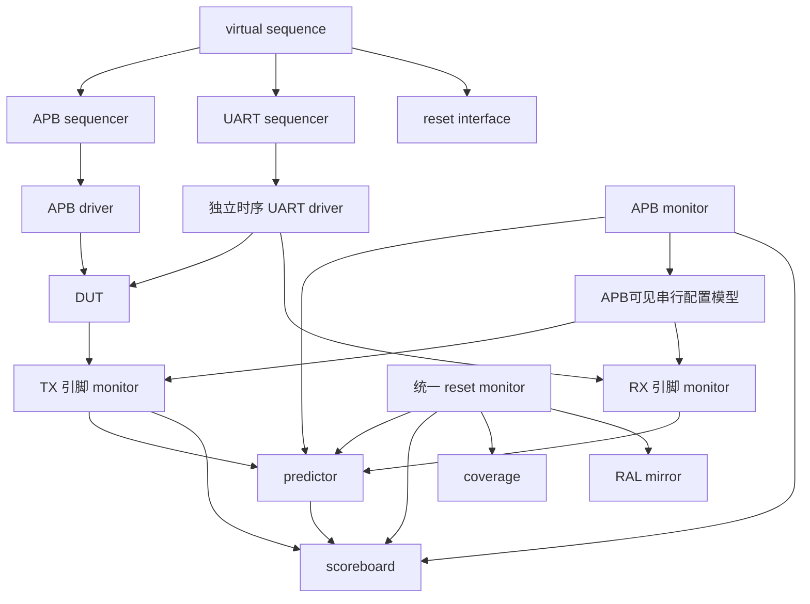

# 验证架构收口说明

## 1. 为什么还要做这一轮

前几轮已经有 agent、predictor、scoreboard、RAL、覆盖率和回归脚本，但还有一个隐患：UART 激励端曾经等待 DUT 内部的 `bit_tick`。如果节拍生成器本身出错，driver 可能跟着错误节拍发送，测试仍有机会“自洽”通过。本轮把激励时序也从 DUT 内部实现中拆出来，并把白盒探针和黑盒接口分开。

本轮不扩展 UART 功能规格。DUT 仍是固定 8N1、单倍 bit tick 的教学模型。

## 2. DUT 与跨时钟结构

TX FIFO、RX FIFO 负责数据跨域；CTRL/BAUD 使用稳定数据束加请求/应答翻转邮箱；RX full 和 frame error 经过两级同步后再进入 APB 可见状态。结构审计只能说明代码满足当前规则，不能替代商业 CDC/RDC 工具。

## 3. UVM 数据流

外部 RX、帧错误、RX FIFO 满和 reset/CDC 场景均由 virtual sequence 协调。driver 只负责产生引脚波形；RX 期望值来自 RX monitor 实际看到的波形；predictor 根据 APB 可见事务解释协议和 FIFO 行为；scoreboard 只比较 expected 与 actual。复位由独立 monitor 统一广播，测试不再手工修正 RAL mirror。

## 4. 黑盒与白盒边界

`uart_if` 是公共接口，只含 `rx_i`、`tx_o`、UART 时钟和复位。数据正确性、帧格式和位宽检查都从这些外部可观察信号得出。

`uart_probe_if` 是白盒接口，集中承载配置邮箱、UART 域生效配置、FIFO 状态和内部控制点。它只用于解释配置跨域时延、连接 SVA 和定位问题，不作为 TX/RX 数据的标准答案。TX/RX monitor 明确不读取该接口；DUT 层次路径只出现在仿真顶层。

## 5. 独立时序与故障检出

UART transaction 提供 `bit_cycles` 和 `edge_offset_ps`。driver 根据公开的 UART 时钟参数计算位周期，并允许起始边沿相对时钟发生偏移。新增的 `uart_external_rx_baud_test` 在 BAUD=4 下发送相位偏移帧，用来证明外部 RX 激励不是写死在 BAUD=1 上。

新增 `UART_MUTATE_BAUD_TICK_FAST` 后，DUT 会错误地把每个 UART 时钟都当作 bit tick。`uart_baud_timing_test` 仍按外部边沿独立测量位宽，因此能够检出该故障。当前声明式 campaign 已扩展到十一类，覆盖 TX/RX 数据、FIFO 状态、IRQ、baud、配置握手、frame error 和复位释放。全部检出只证明这些选定故障没有逃逸，不代表穷尽性覆盖。

## 6. 证据口径

最终证据由一键验收生成，包括 RTL lint、通用器件综合、45 项架构规则、16 项寄存器模型规则、30 项 CDC/RDC 规则、21 项 P2 规则、三组 seed 的 51 次正常仿真、两组共 12 次错相异比压力测试、十一类 mutation、17 项 RTL-only 覆盖率门禁和源码 SHA-256。测试清单、mutation 清单和门禁策略均由 `config/` 下的声明式文件维护。

提交后的 commit 是源码版本锚点；本轮仿真时的精确输入仍以 `source_manifest.md` 为准。若之后改动 RTL、testbench、filelist 或验证脚本，原证据不能自动沿用，必须重新执行验收。
