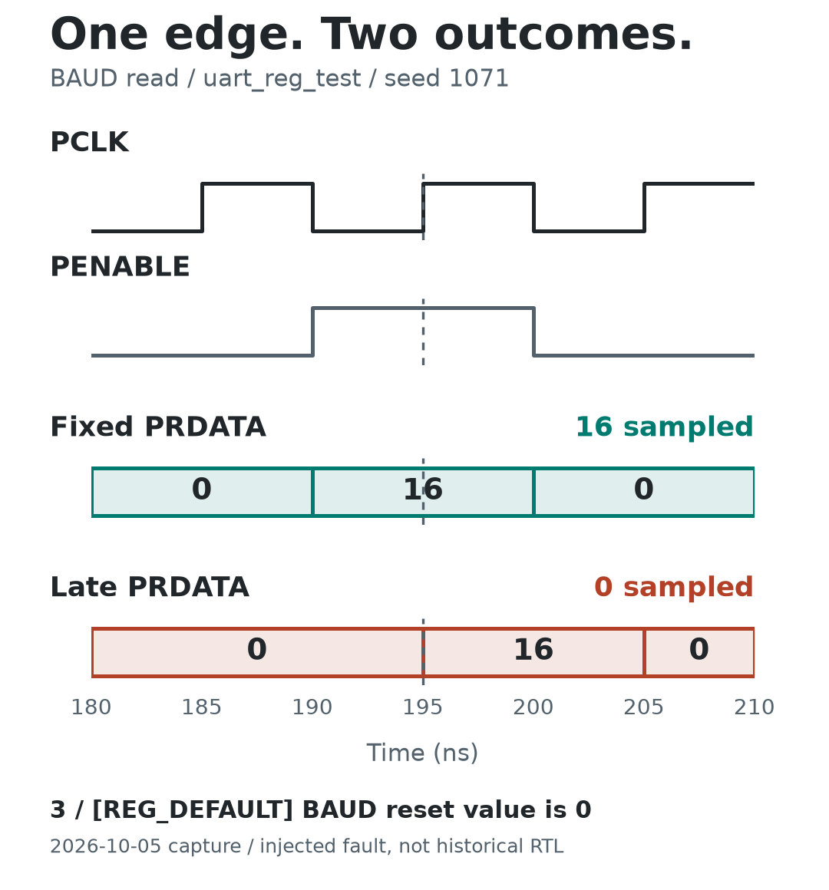
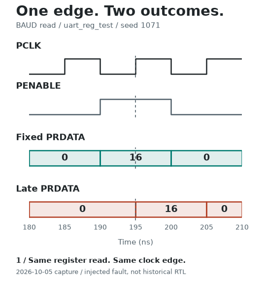

# The Read That Arrived Too Late

Same test, same seed, one RTL mutation. The fixed design returns **16** at the
BAUD read's completion edge; the injected late response is sampled as **0**.

<picture>
  <source media="(prefers-color-scheme: dark)" srcset="comparison-dark.png">
  
</picture>

[Baseline VCD](baseline.vcd) · [Fault VCD](mutant.vcd) ·
[Baseline report excerpt](baseline_excerpt.txt) · [Fault report excerpt](mutant_excerpt.txt) ·
[Source identity and SHA-256 manifest](manifest.json) · [Editable SVG](comparison.svg)

## Watch the Comparison



This animation replays the frozen VCD and one actual log message. Pauses are
extended for reading; it is not a screen recording or a measure of simulation
speed. The static diagram above shows the final state without animation.

## What the Plot Means

- **180 ns:** APB setup for a read of BAUD (`0x08`).
- **190 ns:** PENABLE rises. The fixed design presents PRDATA = 16.
- **195 ns:** the transfer completes on rising PCLK, with PSEL, PENABLE, and
  PREADY high. The clocking block's `input #1step` reads the pre-edge value.
- The mutant assigns PRDATA in the nonblocking-assignment region at 195 ns.
  Its VCD value after that timestamp is 16, but its pre-edge value is 0.
- **200 ns:** the test reports `[REG_DEFAULT] BAUD reset value is 0`.

Signal coordinates come from the VCDs. Their unit is **1 ps**, converted to ns
in the figure. PRDATA is a labeled bus, not a voltage. VCD does not encode a
separate x-coordinate for delta cycles: pre-edge sampling uses values strictly
before the completion timestamp. No 2 ns hardware delay is implied.

## Capture

Recorded **2026-10-05**, on an isolated checkout of
[`a78a5c5`](https://github.com/zlsjtj/apb-uart-fifo-uvm/commit/a78a5c53d360070bba71bcbdf30d887ac069a872).
This is a fresh reintroduction of the defect on fixed sources, not the original
pre-fix trace from the [historical debugging case](../../docs/bug_closure_case.md#english).

| Setting | Value |
| --- | --- |
| Simulator / UVM | ModelSim SE-64 10.4 / UVM 1.1d |
| Test / seed | `uart_reg_test` / `1071` |
| PCLK / UART clock | 10 ns / 40 ns; both phase offsets 0 |
| Baseline | Pass; UVM errors 0, fatals 0 |
| Mutant | `UART_MUTATE_APB_LATE_RESPONSE`; detected |
| Observed failures | 5 UVM errors and 2 assertion errors |

The original campaign and additional VCD runs were checked with the existing
`Get-MutationOutcome` helper. Excerpts retain every test message, assertion
failure, and UVM report entry from `[RNTST]` to the end of the report; vendor
startup notices and shutdown messages are omitted. The manifest records the
original log hashes and excerpt line ranges. VCDs are unmodified. This register
test does not transmit or check UART payload bytes.

## Reproduce the Simulations

Use the [licensed simulator setup](../../docs/quickstart.md). In PowerShell 7,
from the repository root, run the existing one-case campaign first:

```powershell
& ./scripts/run_mutation_campaign.ps1 -CaseIds apb_late
```

It builds `work_mut_baseline` and `work_mut_apb_late`, runs the paired tests,
and must finish with `Mutation campaign passed: 1/1`. Record a new pair without
overwriting this sample:

```powershell
New-Item -ItemType Directory work_apb_trace -ErrorAction Stop
$signals = 'pclk','apb_vif/psel','apb_vif/penable','apb_vif/pwrite','apb_vif/paddr','apb_vif/prdata','apb_vif/pready','apb_vif/pslverr'
$paths = ($signals | ForEach-Object { "/tb_apb_uart/$_" }) -join ' '
foreach ($name in 'baseline','mutant') {
    $library = if ($name -eq 'baseline') { 'work_mut_baseline' } else { 'work_mut_apb_late' }
    $do = "vcd file work_apb_trace/$name.vcd; vcd add $paths; run -all; vcd flush; quit -f"
    & vsim -c "$library.tb_apb_uart" +UVM_TESTNAME=uart_reg_test +PCLK_HALF_NS=5 +UART_HALF_NS=20 +PCLK_PHASE_NS=0 +UART_PHASE_NS=0 -sv_seed 1071 -assertdebug -do $do -l "work_apb_trace/$name.log"
}
```

A simulator exit code of zero alone is not a passing UVM test. Inspect the
reports and use the campaign's detector gate. New traces belong in a separate
capture with their own source identity, not in this frozen sample.

## Rebuild the Figures

Only Python is needed to inspect this sample; no hardware simulator is required.
Use Matplotlib, vcdvcd, and Pillow:

```bash
python -m pip install matplotlib vcdvcd pillow
python -m unittest discover -s examples/apb-timing -v
python examples/apb-timing/render_comparison.py --check-only
python examples/apb-timing/render_comparison.py --output-dir work_apb_figures
```

The renderer verifies hashes, log outcomes, signal presence, time units, the
common read transfer, and sampled values before drawing. Unknown or missing
values in the displayed interval stop rendering. Existing outputs are never
overwritten. The SVG keeps text editable; PNG avoids viewer-dependent fonts.
