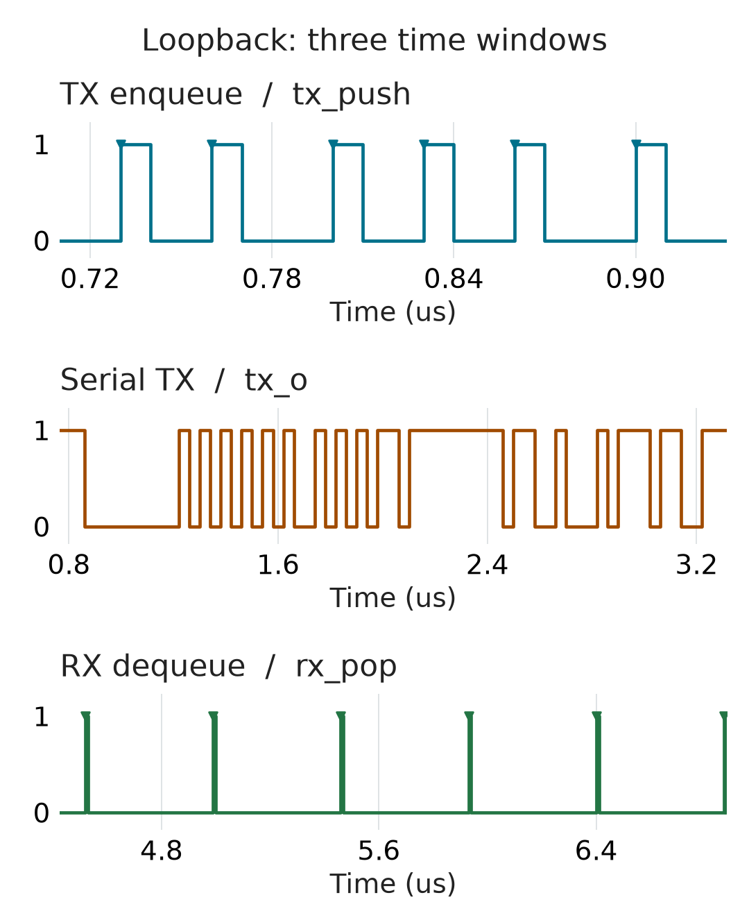

# A Recorded Loopback Run

This small sample was generated on 2026-10-04 with ModelSim SE-64 10.4 and
UVM 1.1d. It is one passing test, not the complete regression.

| File | Contents |
| --- | --- |
| [log_excerpt.txt](log_excerpt.txt) | Original test markers, scoreboard counts, and error summary |
| [loopback.vcd](loopback.vcd) | Unmodified VCD output from the same run |
| [manifest.json](manifest.json) | Command, seed, source-file SHA-256 values, and artifact checksums |
| [preview.png](preview.png) | Derived preview; the original three files above are unchanged |
| [render_preview.py](render_preview.py) | Check the sample and plot its actual transitions |
| [byte-preview.png](byte-preview.png) | Compact view of the second byte, `0x55`, used on the project home page |
| [render_byte_preview.py](render_byte_preview.py) | Match all six APB writes, serial frames and APB reads before annotating one byte |

The scoreboard checked 6 TX bytes and 6 RX bytes, with no UVM warnings, errors,
or fatals. The log excerpt omits simulator banners and library-load messages;
the selected lines have not been rewritten. The full local log and UCDB are
not included in this sample.

The manifest records the parent commit and the tested working-tree source
hash. `includesUncommittedChanges` is true: this run included the Icarus
compatibility changes before they were committed. The parent commit alone
does not identify the exact tested source.

## Follow One Byte


This view selects byte index 1 (the second byte) from the six-byte recording.
The serial bit period comes from the logged UART clock and the recorded BAUD
write. S/P mark the start/stop bits; 0-7 are data bit indices, not their values.
The plot uses the original TX transitions, not a reconstructed ideal waveform.

The APB values are read at the start of each recorded ACCESS phase. This VCD
does not include PCLK or PREADY, so the renderer does not claim to check APB
completion-edge timing. Only the serial frame has a time axis. The internal
loopback leaves the external RX pin idle; the APB RXDATA reads show the received
bytes. This compact plot does not replace the UVM scoreboard or the independent
[APB contract test](../../tb/unit/apb_contract_tb.sv).

## View the Waveform



The rows show `u_dut.tx_push`, `uart_vif.tx_o`, and `u_dut.rx_pop`.
**Each row has its own time window**, with timestamps converted from the VCD's
1 ps unit to microseconds. Pulses retain their original width; triangles mark
their rising edges. The VCD's last timestamp is 6.88 us; the log records test
completion at 8.88 us. The plot does not invent the quiet tail after the final
recorded timestamp.

Open `loopback.vcd` in a VCD viewer such as GTKWave. Useful signals are
`apb_vif.psel`, `penable`, `pwrite`, `paddr`, `pwdata`, `prdata`, and
`uart_vif.tx_o`. The selected VCD signals come from the runner's
`-DumpLoopbackVcd` option.

In loopback mode, `uart_vif.rx_i` is the external input and stays idle;
the loopback connection is inside the DUT. Check the APB RXDATA reads and
scoreboard log to follow the received bytes.

## Regenerate the Preview

With Python 3.12 (the tested version), from the repository root:

```bash
python -m pip install -r examples/loopback/requirements.txt
python examples/loopback/render_preview.py --output work_waveform_preview/preview.png
python examples/loopback/render_byte_preview.py --output work_waveform_preview/byte-preview.png
```

Use an isolated Python environment if needed. No simulator is required to
plot this saved sample. Success prints `PREVIEW_OK` and the VCD SHA-256;
the new image goes to the requested path. Existing output files are not
overwritten: choose a new path for another rendering.

The byte renderer prints `BYTE_PREVIEW_OK`. It checks the same input hashes,
matches all six write/frame/read values in order, and rejects unknown annotated
values, missing signals, incomplete frames, invalid start/stop bits or transitions
inside a bit interval. It is deliberately limited to this fixed-baud 8N1 sample,
not a general UART decoder. Neither command changes the original sample files.

Both renderers use `vcdvcd` and Matplotlib. The full-waveform renderer checks the VCD and log against
`manifest.json`, requires all three plotted signals, and checks the enqueue
and dequeue counts against the recorded scoreboard summary. It stops before
writing an image when these checks fail. X/Z intervals appear as labelled,
hatched gaps, never as valid 0/1 levels. PNG metadata records the source hash
and timescale. This is a visualization check, not a new UART decoder or a
replacement for the UVM checks.

The rendering tests include changed checksums, missing
signals, X/Z handling, time-unit conversion, and output protection:

```bash
python -m unittest discover -s examples/loopback -p "test_render*preview.py"
```

## Reproduce

From the repository root, with the simulator configured:

```powershell
pwsh -NoProfile -File scripts/run_questa.ps1 -Tests uart_loopback_test -Seed 2 -DumpLoopbackVcd
```

New results appear under `logs/` and `reports/`; this recorded sample is not
overwritten. See the [quick start](../../docs/quickstart.md) for setup.

To check the two sample files against their manifest, run from the repository root:

```powershell
$sample = Get-Content examples/loopback/manifest.json -Raw | ConvertFrom-Json
foreach ($artifact in $sample.artifacts) {
    $path = Join-Path examples/loopback $artifact.path
    if ((Get-FileHash $path -Algorithm SHA256).Hash -ne $artifact.sha256) {
        throw "Checksum mismatch: $path"
    }
}
```

These checksums detect changed files; they do not authenticate the author or
prove correctness beyond the recorded test.
